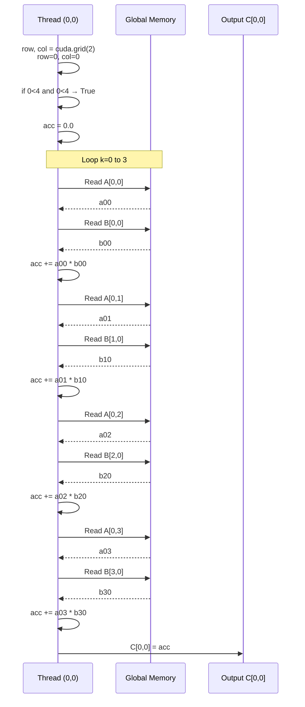
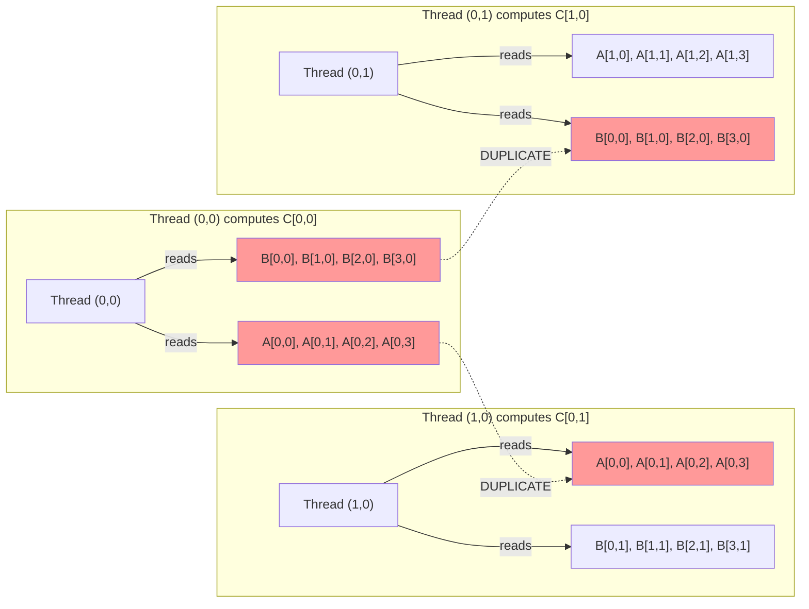
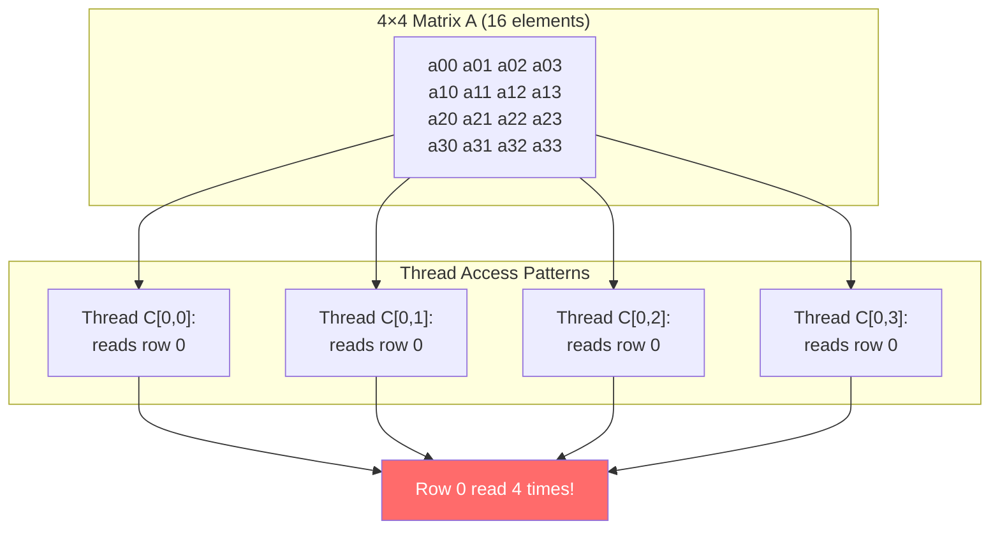
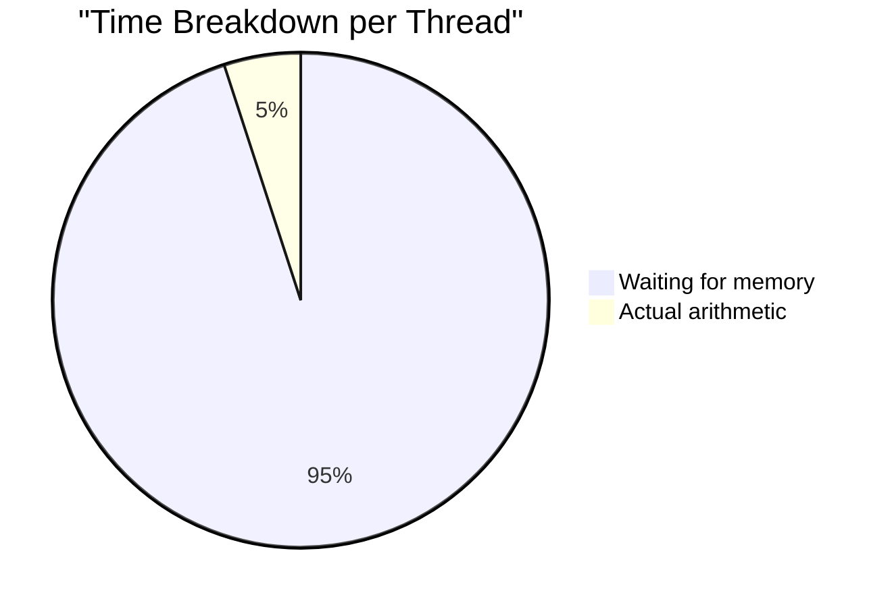
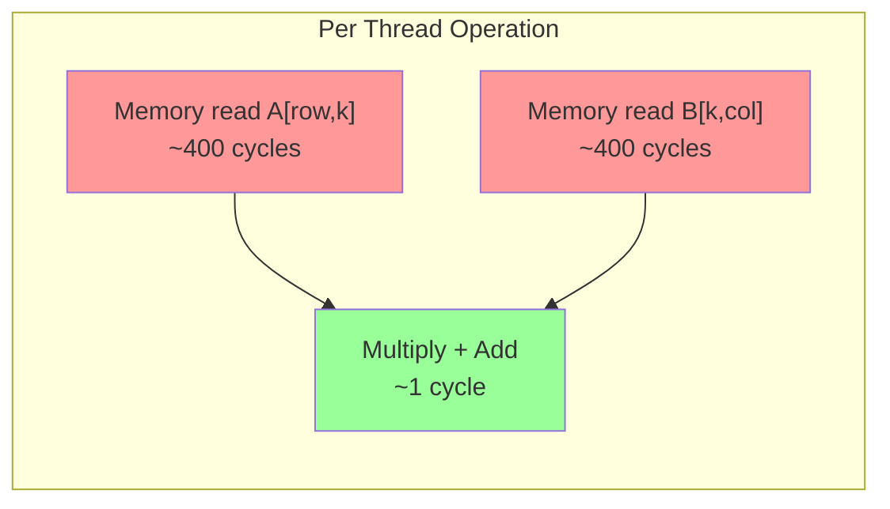
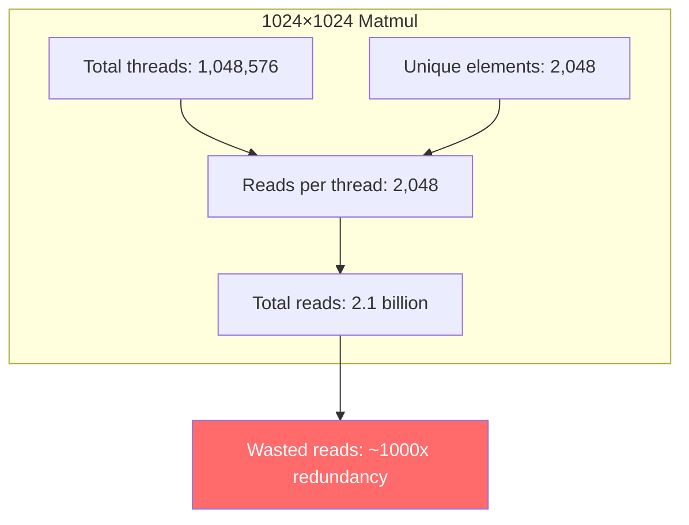

# Naive Matmul - Visual Explanation

## Thread Mapping for 4×4 Matrices

```mermaid
graph TB
    subgraph "GPU Grid: 2×2 blocks"
        direction TB
        subgraph "Block (0,0)"
            B0_T0["Thread (0,0)<br/>→ C[0,0]"]
            B0_T1["Thread (1,0)<br/>→ C[0,1]"]
            B0_T2["Thread (0,1)<br/>→ C[1,0]"]
            B0_T3["Thread (1,1)<br/>→ C[1,1]"]
            B0_T0 --- B0_T1
            B0_T2 --- B0_T3
            B0_T0 --- B0_T2
            B0_T1 --- B0_T3
        end
        
        subgraph "Block (1,0)"
            B1_T0["Thread (0,0)<br/>→ C[0,2]"]
            B1_T1["Thread (1,0)<br/>→ C[0,3]"]
            B1_T2["Thread (0,1)<br/>→ C[1,2]"]
            B1_T3["Thread (1,1)<br/>→ C[1,3]"]
            B1_T0 --- B1_T1
            B1_T2 --- B1_T3
            B1_T0 --- B1_T2
            B1_T1 --- B1_T3
        end
        
        subgraph "Block (0,1)"
            B2_T0["Thread (0,0)<br/>→ C[2,0]"]
            B2_T1["Thread (1,0)<br/>→ C[2,1]"]
            B2_T2["Thread (0,1)<br/>→ C[3,0]"]
            B2_T3["Thread (1,1)<br/>→ C[3,1]"]
            B2_T0 --- B2_T1
            B2_T2 --- B2_T3
            B2_T0 --- B2_T2
            B2_T1 --- B2_T3
        end
        
        subgraph "Block (1,1)"
            B3_T0["Thread (0,0)<br/>→ C[2,2]"]
            B3_T1["Thread (1,0)<br/>→ C[2,3]"]
            B3_T2["Thread (0,1)<br/>→ C[3,2]"]
            B3_T3["Thread (1,1)<br/>→ C[3,3]"]
            B3_T0 --- B3_T1
            B3_T2 --- B3_T3
            B3_T0 --- B3_T2
            B3_T1 --- B3_T3
        end
    end
```

## Thread C[0,0] Execution Flow

## Memory Access Pattern - The Problem

## Data Redundancy Problem

## Why Naive is Memory-Bound

## Scaling to 1024×1024

## How to Import to Excalidraw

1. Copy the Mermaid code blocks above
2. Go to [excalidraw.com](https://excalidraw.com)
3. Enable Mermaid support (Menu → Enable Mermaid)
4. Paste the code into a text element or use the Mermaid library
5. The diagrams will render as editable vector graphics

Alternatively, you can:
- Use [Mermaid Live Editor](https://mermaid.live) to preview and export as SVG/PNG
- Copy the SVG/PNG into Excalidraw for further annotation
- Use Excalidraw's built-in shape library to recreate the concepts manually